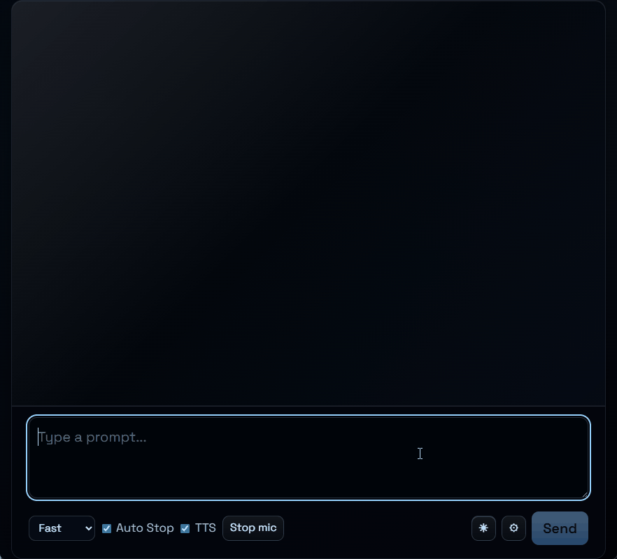

# 🎙️ Vox Golem

[](https://github.com/git-blame-dev/vox-golem/actions/workflows/ci.yml)
[](https://github.com/git-blame-dev/vox-golem/releases/latest)

A Windows-only local AI voice assistant for hands-free coding workflows with wake-word capture, local transcription, and configurable coding backends.



## 🔎 Overview

Vox Golem is a desktop voice assistant for developers who want to drive coding tasks without leaving their editor flow. It combines wake-word listening, silence-based utterance capture, local speech-to-text, and a chat-style command transcript in a Windows Tauri app.

The app is built around local components and explicit runtime configuration. Backends can be selected through `%APPDATA%\VoxGolem\config.toml`, including an `opencode` command path or a local `llama.cpp` server profile.

## ✨ Features

- Wake-word voice capture with automatic stop after silence.
- Typed prompt fallback in the same chat-style interface.
- Transcript, response state, and command output displayed in one desktop UI.
- Configurable response backend with command execution or local `llama.cpp` profiles.
- Local model/profile switching for fast and quality response modes when configured.
- Optional local text-to-speech configuration for spoken responses.

## 🛠️ Tech Stack

- **Desktop shell:** Tauri 2 Windows app.
- **Frontend/tooling:** React 19, TypeScript, Vite, Bun, Vitest, ESLint.
- **Rust core:** Rust workspace for Tauri commands, audio/model/platform crates, and local process orchestration.
- **Voice pipeline:** wake-word detection, voice activity detection, local Parakeet transcription, and app-managed capture state.
- **Local integrations:** `opencode` command execution and `llama.cpp` server profiles.
- **CI / release:** Linux-hosted GitHub Actions for checks, Windows cross-build artifacts, and release publishing.

## 🧠 Engineering Highlights

- Uses a typed runtime state machine so listening, processing, executing, error, and recovery states are explicit in the UI flow.
- Keeps local asset paths and backend selection in `%APPDATA%\VoxGolem\config.toml` instead of hard-coding user machine paths.
- Parses structured `opencode` JSON events into labeled assistant/system output for reviewer-friendly command traces.
- Separates frontend parsing/state tests from Rust runtime checks and Linux-hosted Windows artifact packaging in CI.
- Packages Windows release artifacts with a config template and verifies expected runtime DLLs before publishing.

## 🏗️ Architecture

```text
Microphone / typed prompt
        |
        v
React 19 + Tauri 2 desktop shell
        |
        v
Rust runtime commands
        |
        +--> Voice pipeline: wake word -> speech activity -> local transcription
        |
        +--> Response backend: opencode or local llama.cpp profile
        |
        v
Transcript, runtime status, and command output in the UI
```

The frontend owns interaction state and renders the transcript. Tauri commands bridge UI events to Rust runtime code, which resolves local config, initializes voice components, and routes prompts to the selected backend.

Key directories:

- `frontend/` - React UI, transcript rendering, interaction state, and typed prompt flow.
- `apps/windows-tauri/` - Tauri desktop shell and UI-to-runtime command bridge.
- `crates/audio/` - wake-word, capture, and voice activity pipeline boundaries.
- `crates/model/` - local model and transcription-related runtime code.
- `crates/core/` - prompt execution, backend routing, and shared runtime behavior.
- `crates/platform/` - platform-specific runtime integration.
- `Makefile` - canonical local and CI command surface for checks, Windows cross-builds, and release staging.

## 🚀 Getting Started

### Prerequisites

- Windows runtime environment.
- Bun for frontend development scripts.
- Rust stable toolchain for workspace checks and Tauri builds.
- Linux build tools for Windows cross-builds: `cargo-xwin`, Tauri CLI, CMake, Ninja, LLVM tools, `lld`, `curl`, and `unzip`.
- Local model/runtime assets referenced by `%APPDATA%\VoxGolem\config.toml`.

### Configure local assets

1. Create the config directory:

   ```powershell
   New-Item -ItemType Directory -Force "$env:APPDATA\VoxGolem"
   ```

2. Copy [`config.example.toml`](config.example.toml):

   ```powershell
   Copy-Item .\config.example.toml "$env:APPDATA\VoxGolem\config.toml"
   ```

3. Update the paths in `config.toml` for your local wake-word, transcription, VAD, backend, model, and optional TTS assets.

### Install and verify

```bash
make test
```

Run the frontend development shell when you need live UI iteration:

```bash
make app-dev
```

Build the portable Windows app from Linux:

```bash
make pc
```

Stage the user-testable release files locally:

```bash
make dist
```

Staged files are written to `dist/VoxGolem/`, matching the GitHub Actions artifact layout.

## ✅ Testing

Local checks cover frontend type safety, linting, UI state, startup parsing, runtime control, prompt execution parsing, voice-flow behavior, and production frontend build output.

```bash
make test
```

CI runs `make test` on Linux and builds the Windows artifact with `make pc-dist` on Linux.

CI proves formatting, linting, tests, and Linux-hosted Windows build/package creation; final microphone, audio-device, WebView, GPU/runtime, and model behavior still requires manual validation on a Windows machine.

## 📦 Releases / Artifacts

[GitHub Releases](https://github.com/git-blame-dev/vox-golem/releases) publish `vox-golem-<version>.zip` and `SHA256SUMS` from successful CI runs on `main` when release-relevant files change.

The packaged artifact includes the Windows executable, `config.toml` template, CUDA/cuDNN runtime DLLs, and required runtime DLLs verified by the workflow.

Local staging uses the same layout:

```text
dist/VoxGolem/config.toml
dist/VoxGolem/vox-golem.exe
dist/VoxGolem/*.dll
```

## ⚠️ Limitations

- Windows-only runtime target; Linux is used to build and package the Windows artifact but is not the supported app runtime.
- Requires local model/runtime assets that are not bundled in the source tree.
- Voice quality, latency, and backend behavior depend on the user's configured models and machine.
- Windows runtime readiness should be validated from the generated Windows artifact, not inferred from frontend-only checks.
- Voice input and generated outputs should be treated as local user data; avoid committing recordings, model files, or generated artifacts.

## 🧯 Troubleshooting

- **Missing config:** ensure `%APPDATA%\VoxGolem\config.toml` exists and is based on [`config.example.toml`](config.example.toml).
- **Missing model or executable:** check that every configured path points to an existing file, directory, or executable on the Windows machine.
- **Backend does not respond:** confirm `response_backend` matches the configured `[opencode]` or `[llama_cpp]` table.
- **Unsure which release files to use:** download the latest GitHub Release zip and verify it against `SHA256SUMS`.
